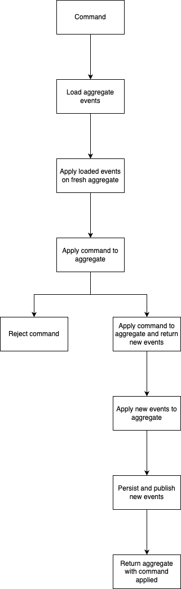

# CQRS
Generic Eventsourcing / CQRS implementation in Go 

## Write model: creating a new aggregate

1. Define a new struct that embed `eventsourcing.AggregateBase`
   ```go
   const GroupAggregateType eventsourcing.AggregateType = "group"

   // Group is the aggregate root
   type Group struct {
     *eventsourcing.AggregateBase[Group]

     // it has a name property that is private to make sure it is only updated 
     // through domain events
     name string
   }

   // NewGroup is creates a new Group aggregate
   func NewGroup() *Group {
      return &Group{
        AggregateBase: eventsourcing.NewAggregateBase[Group](uuid.Nil, 0),
      }
    }

   // AggregateType is required to implement the Aggregate interface
   func (g Group) AggregateType() eventsourcing.AggregateType {
     return GroupAggregateType
   }

   // Name makes the name property accessible
   func (g Group) Name() string {
     return g.name
   }
   ```

2. Define and register events
   ```go
   const EvtTypeGroupCreated       eventsourcing.EventType = "group.created"

   // RegisterGroupEvents registers events so they can be hydrated from the event store
   func RegisterGroupEvents(registry eventsourcing.EventRegistry[Group]) {
      registry.Register(EvtTypeGroupCreated, func() eventsourcing.Event[Group] {
        return &EvtGroupCreated{
          EventBase: &eventsourcing.EventBase[Group]{},
        }
      })
      registry.Register(EvtTypeGroupNameSet, func() eventsourcing.Event[Group] {
        return &EvtGroupNameSet{
          EventBase: &eventsourcing.EventBase[Group]{},
        }
      })
    }

    // EvtGroupCreated is emitted when a group is created
    type EvtGroupCreated struct {
      *eventsourcing.EventBase[Group]
    }

    // NewEvtGroupCreated is a helper to create a new EvtGroupCreated event 
    // with the appropriate event base
    func NewEvtGroupCreated(aggregateId uuid.UUID, aggregateVersion int, createdBy eventsourcing.User) *EvtGroupCreated {
      return &EvtGroupCreated{
        EventBase: eventsourcing.NewEventBase[Group](
          GroupAggregateType,
          aggregateVersion,
          EvtTypeGroupCreated,
          aggregateId,
          createdBy,
        ),
      }
    }

    // Apply performs the changes on the aggregate
    func (e EvtGroupCreated) Apply(g *Group) error {
      // helper to define the aggregate base properties (created_at, ..)
      // on creation event we call init instead of process
      g.Init(e)

      return nil
    }

    // EvtGroupNameSet is emitted when name is set
    type EvtGroupNameSet struct {
      *eventsourcing.EventBase[Group]
      name string
    }

    func NewEvtGroupNameSet(aggregateId uuid.UUID, aggregateVersion int, updatedBy eventsourcing.User, name string) *EvtGroupNameSet {
      return &EvtGroupNameSet{
        EventBase: eventsourcing.NewEventBase[Group](
          GroupAggregateType,
          aggregateVersion,
          EvtTypeGroupNameSet,
          aggregateId,
          updatedBy,
        ),
        name: name,
      }
    }

    func (e EvtGroupNameSet) Apply(g *Group) error {
      // helper to define the aggregate base properties (modified_at, ..)
      g.Process(e)
      // update the aggregate name
      g.name = e.name

      return nil
    }
   ```
3. Create use case
   ```go
    // cmdCreate is the command to create a new group
    type cmdCreate struct {
      // to make cmdCreate a command
      eventsourcing.CommandBase[domain.Group]
      // Name the property of the command
      Name string `validate:"required"`
    }

    // CreateHandler is the usecase handler 
    type CreateHandler struct {
      validator      *validator.Validate
      commandHandler eventsourcing.CommandHandler[domain.Group]
    }

    func NewCreateHandler(commandHandler eventsourcing.CommandHandler[domain.Group]) CreateHandler {
      validator := validator.New(validator.WithRequiredStructEnabled())

      return CreateHandler{
        commandHandler: commandHandler,
        validator:      validator,
      }
    }

    func (h CreateHandler) Create(ctx context.Context, issuer eventsourcing.User, name string) (*domain.Group, error) {
      // let's validate the command
      err := h.validator.Struct(cmd)
      if err != nil {
        log.Error().Err(err).Msg("create: invalid command")
        return nil, err
      }

      // we return an error if the command should not be accepted
      // business logic to check if the command is valid should be implemented here
      // like checking if it is possible to create a group for this issuer

      return h.commandHandler.HandleCommand(
        ctx, 
        cmdCreate{
          CommandBase: eventsourcing.NewCommandBase[domain.Group](
            uuid.New(), // new aggregate id
            domain.AggregateGroup, // aggregate type
            issuer, // tracking who did create that group
          ),
          Name: name,
        },  
      )
    }

    // Apply returns a list of events that should be emitted when the command is applied
    func (c cmdCreate) Apply(aggregate *domain.Group) ([]eventsourcing.Event[domain.Group], error) {
      return []eventsourcing.Event[domain.Group]{
        // the new group is created
        domain.NewEvtGroupCreated(c.AggregateId(), 0, c.IssuedBy()),
        // the name is set
        domain.NewEvtGroupNameSet(c.AggregateId(), 1, c.IssuedBy(), c.Name),
      }, nil
    }
   ```

   At this point we have an event sourcing system for creating groups

## Read model: handling events

1. Create a new read model (in memory for the example, relying on the generic one from the library)
   ```go
    type GroupQuery struct {
      id *uuid.UUID
    }

    func NewGroupQuery(id *uuid.UUID) *GroupQuery {
      return &GroupQuery{
        id: id,
      }
    }

    func (q GroupQuery) Id() *uuid.UUID {
      return q.id
    }

    type inMemoryReadModel struct {
      rm *readmodel.InMemoryReadModel[domain.Group]
    }

    func NewInMemoryReadModel(eventStream eventsourcing.Subscriber[domain.Group]) *inMemoryReadModel {
      return &inMemoryReadModel{
        rm: readmodel.NewInMemoryReadModel[domain.Group](
          eventStream,
          domain.NewGroup,
          domain.EvtTypeGroupCreated,
          eventsourcing.EvtTypeNil, // Replace by the appropriate event type when the event is implemented
          eventsourcing.EvtTypeNil, // Replace by the appropriate events type when the event is implemented. Make sure to list all the events the read model should be handling
        ),
      }
    }

    // HandleEvent definition is optional as Find and Get will handle the job
    // however it might be useful to have it exposed for testing purpose (manually injecting events)
    func (l *inMemoryReadModel) HandleEvent(e eventsourcing.Event[domain.Group]) {
      l.rm.HandleEvent(e)
    }

    func (l *inMemoryReadModel) Find(ctx context.Context, query GroupQuery) ([]*domain.Group, error) {
      return l.rm.Find(ctx, aggregateMatcher(query))
    }

    func (l *inMemoryReadModel) Get(ctx context.Context, query GroupQuery) (*domain.Group, error) {
      return l.rm.Get(ctx, aggregateMatcher(query))
    }

    // aggregateMatcher is a helper function to build the aggregate matcher based on the query
    // in a database scenario it would be used to build the where clause
    func aggregateMatcher(query GroupQuery) readmodel.AggregateMatcher[domain.Group] {
      var matcher readmodel.AggregateMatcher[domain.Group]

      if query != nil {
        matcher = readmodel.AggregateMatcherAnd[domain.Group](
          readmodel.AggregateMatcherAggregateId[domain.Group](query.Id()),
        )
      }

      return matcher
    }
   ```
2. Create the list use case
   ```go
   type GroupReadModel interface {
      Find(ctx context.Context, query GroupQuery) ([]*domain.Group, error)
      Get(ctx context.Context, query GroupQuery) (*domain.Group, error)
    }

    type ListHandler struct {
      groupReadModel GroupReadModel
    }

    func NewListHandler(groupReadModel GroupReadModel) ListHandler {
      return ListHandler{
        groupReadModel: groupReadModel,
      }
    }

    func (h ListHandler) List(ctx context.Context, issuedBy eventsourcing.User, query GroupQuery) ([]*domain.Group, error) {
      // TODO: check if possible to list groups for this issuer
      return h.groupReadModel.Find(ctx, query)
    }
   ```


